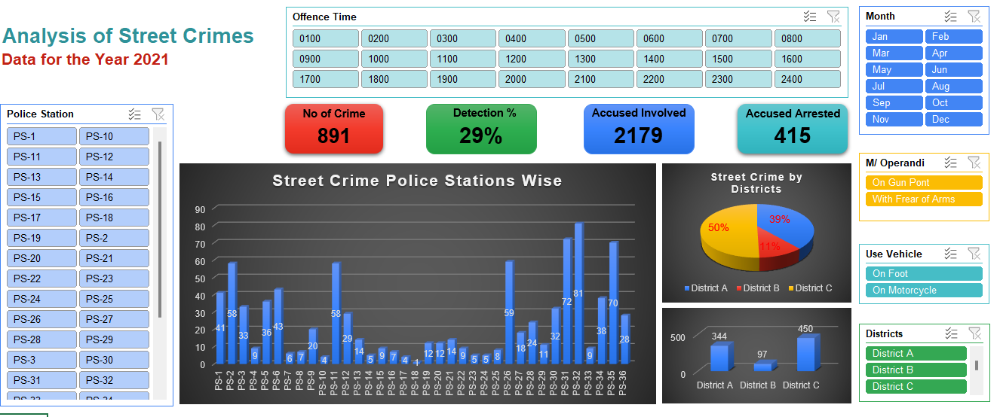
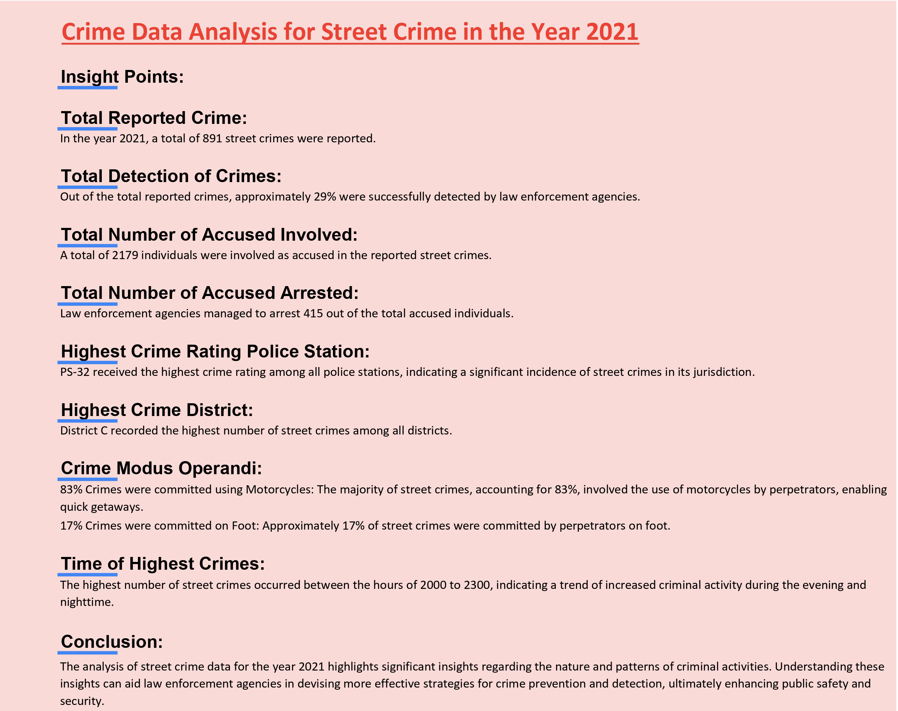

# Crime Data Analysis for Street Crime in the Year 2021

    
 

## Insight Points:

### Total Reported Crime:
In the year 2021, a total of 891 street crimes were reported.

### Total Detection of Crimes:
Out of the total reported crimes, approximately 29% were successfully detected by law enforcement agencies.

### Total Number of Accused Involved:
A total of 2179 individuals were involved as accused in the reported street crimes.

### Total Number of Accused Arrested:
Law enforcement agencies managed to arrest 415 out of the total accused individuals.

### Highest Crime Rating Police Station:
PS-32 received the highest crime rating among all police stations, indicating a significant incidence of street crimes in its jurisdiction.

### Highest Crime District:
District C recorded the highest number of street crimes among all districts.

### Crime Modus Operandi:
- **83% Crimes were committed using Motorcycles:** The majority of street crimes, accounting for 83%, involved the use of motorcycles by perpetrators, enabling quick getaways.
- **17% Crimes were committed on Foot:** Approximately 17% of street crimes were committed by perpetrators on foot.

### Time of Highest Crimes:
The highest number of street crimes occurred between the hours of 2000 to 2300, indicating a trend of increased criminal activity during the evening and nighttime.

## Conclusion:
The analysis of street crime data for the year 2021 highlights significant insights regarding the nature and patterns of criminal activities. Understanding these insights can aid law enforcement agencies in devising more effective strategies for crime prevention and detection, ultimately enhancing public safety and security.

